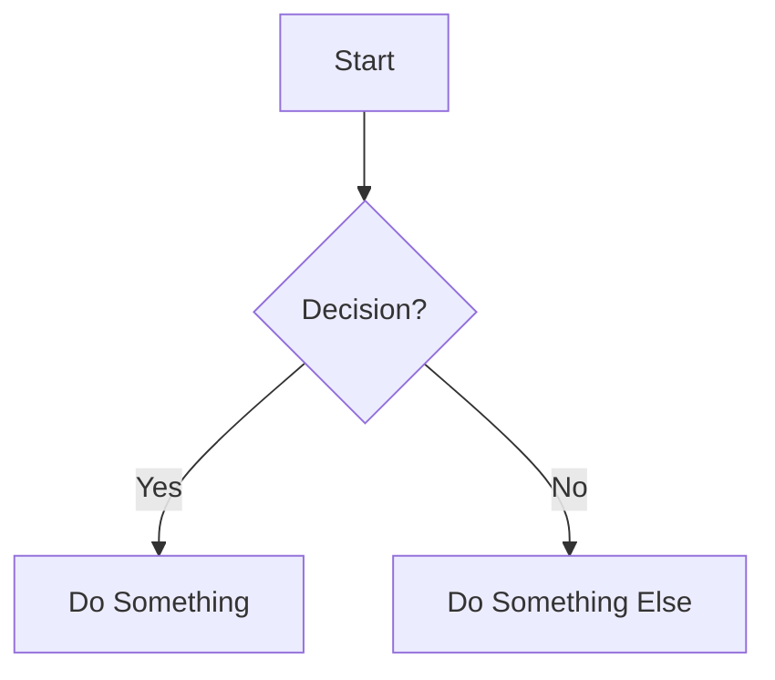

# 🎨 Awesome Static Tools

> A curated collection of the best JavaScript libraries, CSS tricks, and interactive features for building beautiful, performant personal websites and blogs with 11ty (or any JAMstack framework).

[](https://choosealicense.com/licenses/mit/)
[](http://makeapullrequest.com)
[](https://github.com/brennanbrown/awesome-static-tools)

---

## 🚀 Deploy to Netlify

[](https://app.netlify.com/start/deploy?repository=https://github.com/brennanbrown/awesome-static-tools)

This will clone the repo to your account, set build to `npm run build` and publish `_site/`.

---

## 📖 Table of Contents

- [🎨 Awesome Static Tools](#-awesome-static-tools)
  - [📖 Table of Contents](#-table-of-contents)
  - [✨ Features](#-features)
  - [🚀 Quick Start](#-quick-start)
    - [Installation Methods](#installation-methods)
  - [📚 Categories](#-categories)
    - [✍️ Text Highlighting & Annotations](#️-text-highlighting--annotations)
      - [Rough Notation](#rough-notation)
      - [Mark.js](#markjs)
    - [📝 Footnotes & Sidenotes](#-footnotes--sidenotes)
      - [Littlefoot.js](#littlefootjs)
      - [Tufte CSS](#tufte-css)
    - [🎯 Interactive Elements](#-interactive-elements)
      - [Tippy.js](#tippyjs)
    - [🔍 Search](#-search)
    - [💬 Comments](#-comments)
    - [⚡ Interactivity (Forms & Toggles)](#-interactivity-forms--toggles)
    - [🎬 Scroll Effects](#-scroll-effects)
      - [AOS (Animate On Scroll)](#aos-animate-on-scroll)
      - [Reading Progress Bar](#reading-progress-bar)
    - [🔤 Typography](#-typography)
      - [Typetura](#typetura)
      - [Reading Time Estimator](#reading-time-estimator)
    - [🖼️ Images \& Media](#️-images--media)
      - [medium-zoom](#medium-zoom)
    - [💻 Code \& Diagrams](#-code--diagrams)
      - [Prism.js](#prismjs)
      - [Mermaid.js](#mermaidjs)
    - [📖 Reading Experience](#-reading-experience)
      - [Pure CSS Techniques](#pure-css-techniques)
      - [Reading Progress Indicators](#reading-progress-indicators)
    - [🌐 Social \& Sharing](#-social--sharing)
      - [Web Share API](#web-share-api)
      - [web-social-share](#web-social-share)
    - [🌙 Dark Mode](#-dark-mode)
      - [Implementation Guides](#implementation-guides)
  - [🔧 11ty Integration](#-11ty-integration)
    - [Shortcodes](#shortcodes)
    - [Filters](#filters)
    - [Markdown-it Plugins](#markdown-it-plugins)
  - [⚡ Performance Tips](#-performance-tips)
    - [General Best Practices](#general-best-practices)
    - [Library-Specific](#library-specific)
  - [🔗 Additional Resources](#-additional-resources)
    - [Text Highlighting \& Annotations](#text-highlighting--annotations)
    - [Footnotes \& Sidenotes](#footnotes--sidenotes)
    - [Scroll Animations](#scroll-animations)
    - [Images \& Media](#images--media)
    - [Code \& Diagrams](#code--diagrams)
    - [Dark Mode](#dark-mode)
    - [11ty Ecosystem](#11ty-ecosystem)
    - [Performance \& Modern CSS](#performance--modern-css)
  - [🌐 Browser Support](#-browser-support)
  - [📝 Examples](#-examples)
  - [🤝 Contributing](#-contributing)
  - [📜 License](#-license)
  - [🙏 Acknowledgments](#-acknowledgments)
  - [❤️ Support This Project](#️-support-this-project)
  - [📮 Stay Connected](#-stay-connected)

---

## ✨ Features

This repository collects the **best-in-class** JavaScript libraries and CSS techniques specifically curated for:

- 📝 **Personal blogs & writing sites**
- 🎓 **Documentation sites**
- 📰 **Digital publications**
- 🌐 **Static sites (JAMstack)**
- 🔌 **11ty (Eleventy) projects** (with specific integration guides!)

All libraries are:
- ✅ Lightweight & performant
- ✅ Mobile-friendly & accessible
- ✅ Framework-agnostic (works with vanilla JS)
- ✅ Well-documented with examples
- ✅ Actively maintained

---

## 🚀 Quick Start

1. **Browse the categories** below to find features you want
2. **Read the [docs/](./docs/)** for detailed implementation guides
3. **Run the Eleventy site locally** to explore working demos:
   ```bash
   npm install
   npm run serve
   # Open http://localhost:8080/
   ```
4. **Visit demo routes** like `/`, `/demo/`, and `/demos/*` (listed below)

### Installation Methods

Most libraries can be installed via:

**NPM/Yarn:**
```bash
npm install library-name
# or
yarn add library-name
```

**CDN (for quick prototyping):**
```html
<script src="https://unpkg.com/library-name"></script>
```

**Direct Download:**
Visit the library's GitHub repository and download the latest release.

---

## 📚 Categories

### ✍️ Text Highlighting & Annotations

#### Rough Notation
Hand-drawn style annotations with a sketchy, human feel.

- **Size:** 3.8kb gzipped
- **Website:** https://roughnotation.com/
- **GitHub:** https://github.com/rough-stuff/rough-notation
- **npm:** `npm install rough-notation`
- **Styles:** Underline, box, circle, highlight, strike-through, bracket
- **Integration:** [View Guide](./docs/rough-notation.md)

```javascript
import { annotate } from 'rough-notation';
const element = document.querySelector('#myElement');
const annotation = annotate(element, { type: 'highlight', color: 'yellow' });
annotation.show();
```

#### Mark.js
Programmatic text highlighting and search term marking.

- **Website:** https://markjs.io/
- **GitHub:** https://github.com/julkue/mark.js
- **npm:** `npm install mark.js`
- **Features:** Diacritics support, separate word search, custom synonyms
- **Integration:** [View Guide](./docs/markjs.md)

---

### 📝 Footnotes & Sidenotes

#### Littlefoot.js
Converts footnotes to interactive popovers (no jQuery required!).

- **Website:** https://littlefoot.js.org/
- **GitHub:** https://github.com/goblindegook/littlefoot
- **npm:** `npm install littlefoot`
- **CDN:**
  ```html
  <link rel="stylesheet" href="https://unpkg.com/littlefoot/dist/littlefoot.css" />
  <script src="https://unpkg.com/littlefoot/dist/littlefoot.js"></script>
  ```
- **Integration:** [View Guide](./docs/littlefoot.md)

#### Tufte CSS
Beautiful sidenote styling inspired by Edward Tufte's work.

- **Website:** https://edwardtufte.github.io/tufte-css/
- **GitHub:** https://github.com/edwardtufte/tufte-css
- **Type:** Pure CSS (no JavaScript!)
- **Features:** Sidenotes, margin notes, elegant typography
- **Integration:** [View Guide](./docs/tufte-css.md)

---

### 🎯 Interactive Elements

#### Tippy.js
Highly customizable tooltips, popovers, and dropdowns.

- **Website:** https://atomiks.github.io/tippyjs/
- **GitHub:** https://github.com/atomiks/tippyjs
- **npm:** `npm install tippy.js`
- **Features:** 
  - Multiple themes & animations
  - Interactive content
  - HTML support
  - Follow cursor
  - Singleton instances
- **Integration:** [View Guide](./docs/tippyjs.md)

```javascript
import tippy from 'tippy.js';
import 'tippy.js/dist/tippy.css';

tippy('#myButton', {
  content: 'I'm a tooltip!',
  theme: 'light',
  animation: 'scale'
});
```

#### ez-tip (Alternative to Tippy.js)
A zero-dependency tooltip helper that relies on CSS custom properties for styling.

- **GitHub:** https://github.com/graphieros/ez-tip
- **Features:** No dependencies, style via CSS variables
- **Integration:** [View Guide](./docs/ez-tip.md)

#### PhotoSwipe (Gallery/Lightbox)
Zero-dependency, touch-friendly image gallery for mobile and desktop.

- **Website:** https://photoswipe.com/
- **GitHub:** https://github.com/photoswipe/photoswipe
- **Features:** Touch gestures, high performance, customizable UI
- **Integration:** [View Guide](./docs/photoswipe.md)

#### Eleventy Image (Build-Time Optimization)
Official Eleventy plugin for responsive, next-gen images (WebP/AVIF) at build time.

- **Website:** https://www.11ty.dev/docs/plugins/image/
- **GitHub:** https://github.com/11ty/eleventy-img
- **npm:** `npm install @11ty/eleventy-img`
- **Integration:** [View Guide](./docs/eleventy-image.md)

---

### 🎬 Scroll Effects

#### AOS (Animate On Scroll)
Animate elements as you scroll.

- **Website:** https://michalsnik.github.io/aos/
- **GitHub:** https://github.com/michalsnik/aos
- **npm:** `npm install aos`
- **CDN:**
  ```html
  <link href="https://unpkg.com/aos@2.3.1/dist/aos.css" rel="stylesheet">
  <script src="https://unpkg.com/aos@2.3.1/dist/aos.js"></script>
  ```
- **Animations:** Fade, flip, zoom, slide
- **Integration:** [View Guide](./docs/aos.md)

```html
<div data-aos="fade-up" data-aos-duration="1000">
  Content that fades up!
</div>
```

#### Reading Progress Bar
Visual indicator of reading progress.

- **Pure CSS + JS Implementation:** [View Guide](./docs/reading-progress.md)
- **Libraries:**
  - [scrollProgress.js](https://github.com/jeremenichelli/scrollProgress)
  - DIY: [Tutorial](https://www.florin-pop.com/blog/2017/08/reading-progress-bar/)

#### Sal.js (Scroll Animation Library)
Performance-focused, tiny (<3kb) scroll animation library in vanilla JS. Great minimal alternative to AOS for simple reveals.

- **GitHub:** https://github.com/mciastek/sal
- **Features:** Small, no dependencies, easy to use
- **Integration:** [View Guide](./docs/saljs.md)

#### Scroll-Out
Zero-dependency utility that exposes scroll position/direction as CSS variables for CSS-driven effects.

- **GitHub:** https://github.com/scroll-out/scroll-out
- **Features:** CSS variables for scroll progress, flexible
- **Integration:** [View Guide](./docs/scroll-out.md)

---

### 🔤 Typography

#### Typetura
Fluid, responsive typography with keyframe-based scaling.

- **Website:** https://typetura.scottkellum.com/
- **GitHub:** https://github.com/Typetura/Typetura
- **Features:** 
  - Curve interpolation
  - Variable font support
  - Container queries
  - No JavaScript required (CSS-only!)
- **Integration:** [View Guide](./docs/typetura.md)

#### Lettering.js
Fine-grained control over typography by wrapping letters/words/lines in spans.

- **Website:** http://letteringjs.com/
- **GitHub:** https://github.com/letteringjs/lettering.js
- **Features:** Advanced typographic styling and animation
- **Integration:** [View Guide](./docs/letteringjs.md)

#### Reading Time Estimator
Display estimated reading time.

- **npm packages:**
  - `reading-time` (most popular)
  - `reading-time-estimator` (i18n support)
  - `@iamtraction/read-time`
- **DIY:** [Simple Tutorial](./docs/reading-time.md)

```javascript
import readingTime from 'reading-time';
const stats = readingTime(text);
// Output: { text: '1 min read', minutes: 1, time: 60000, words: 200 }
```

---

### 🖼️ Images & Media

#### medium-zoom
Medium-style image zoom effect.

- **Demo:** https://medium-zoom.francoischalifour.com/
- **GitHub:** https://github.com/francoischalifour/medium-zoom
- **npm:** `npm install medium-zoom`
- **Size:** Lightweight & framework agnostic
- **Integration:** [View Guide](./docs/medium-zoom.md)

```javascript
import mediumZoom from 'medium-zoom';
mediumZoom('[data-zoomable]', {
  margin: 24,
  background: '#000',
  scrollOffset: 0
});
```

---

### 💻 Code & Diagrams

#### Prism.js
Elegant syntax highlighting for code blocks.

- **Website:** https://prismjs.com/
- **GitHub:** https://github.com/PrismJS/prism
- **npm:** `npm install prismjs`
- **Size:** 2KB core (languages ~300-500 bytes each)
- **Languages:** 300+
- **Plugins:** Line numbers, copy-to-clipboard, etc.
- **Integration:** [View Guide](./docs/prismjs.md)

#### Mermaid.js
Diagrams and flowcharts from text.

- **Website:** https://mermaid.js.org/
- **GitHub:** https://github.com/mermaid-js/mermaid
- **Live Editor:** https://mermaid.live/
- **npm:** `npm install mermaid`
- **Diagram Types:** Flowcharts, sequence, Gantt, class diagrams, more
- **Integration:** [View Guide](./docs/mermaid.md)



---

### 📖 Reading Experience

#### Pure CSS Techniques

**Custom Highlight Colors**
```css
::selection {
  background-color: var(--highlight-color, yellow);
  color: var(--highlight-text-color, black);
}
```

**Drop Caps**
```css
p::first-letter {
  font-size: 3em;
  float: left;
  line-height: 0.8;
  margin: 0.1em 0.1em 0 0;
}
```

**Better Text Wrapping** (Modern CSS)
```css
h1 {
  text-wrap: balance; /* Balance line lengths in headings */
}

p {
  text-wrap: pretty; /* Avoid orphans in paragraphs */
}
```

#### Reading Progress Indicators

Multiple implementations available:
- Pure CSS + vanilla JS
- Third-party libraries
- [Full Tutorial](./docs/reading-progress.md)

---

### 🌐 Social & Sharing

#### Web Share API
Native sharing using the browser's built-in capabilities.

- **MDN Docs:** https://developer.mozilla.org/en-US/docs/Web/API/Web_Share_API
- **Browser Support:** Mobile browsers, some desktop
- **Fallback:** Traditional share buttons
- **Integration:** [View Guide](./docs/web-share-api.md)

```javascript
if (navigator.share) {
  await navigator.share({
    title: 'Article Title',
    text: 'Check out this article!',
    url: window.location.href
  });
}
```

#### web-social-share
Web component for social sharing (fallback for unsupported browsers).

- **Website:** https://websocialshare.com
- **GitHub:** https://github.com/peterpeterparker/web-social-share
- **npm:** `npm install web-social-share`

---

### 🌙 Dark Mode

#### Implementation Guides

**Best Practice: CSS + localStorage**
```javascript
// Detect system preference
const prefersDark = window.matchMedia('(prefers-color-scheme: dark)').matches;

// Get saved preference or use system
const theme = localStorage.getItem('theme') || (prefersDark ? 'dark' : 'light');

// Apply theme
document.documentElement.setAttribute('data-theme', theme);
```

**Resources:**
- [Ultimate Theme Toggle Tutorial](https://whitep4nth3r.com/blog/best-light-dark-mode-theme-toggle-javascript/)
- [drkmd.js Library](https://drkmd.mxis.ch/)
- [dark-mode-toggle (Google)](https://www.npmjs.com/package/dark-mode-toggle)
- [DIY Guide](./docs/dark-mode.md)

---

## 🔧 11ty Integration

Special guides for integrating these features with [Eleventy (11ty)](https://www.11ty.dev/):

### Shortcodes
Create custom shortcodes for easy markdown integration:

```javascript
// .eleventy.js
eleventyConfig.addShortcode("highlight", function(text, color) {
  return `<mark style="background: ${color}">${text}</mark>`;
});
```

### Filters
Add reading time as a filter:

```javascript
const readingTime = require('reading-time');

eleventyConfig.addFilter("readingTime", (content) => {
  const stats = readingTime(content);
  return stats.text;
});
```

### Markdown-it Plugins
Enhance markdown processing:

- **Syntax Highlighting:** `markdown-it-prism` or `@11ty/eleventy-plugin-syntaxhighlight`
- **Footnotes:** `markdown-it-footnote`
- **Anchors:** `markdown-it-anchor`

📚 **Full 11ty Integration Guide:** [View Here](./docs/11ty-integration.md)

---

## ⚡ Performance Tips

### General Best Practices

1. **Load scripts asynchronously:**
   ```html
   <script src="library.js" defer></script>
   <!-- or -->
   <script src="library.js" async></script>
   ```

2. **Use CDNs for caching:**
   - unpkg.com
   - cdnjs.com
   - jsdelivr.net

3. **Lazy load non-critical features:**
   - Prefer native lazy loading for images/iframes:
     ```html
     
     <iframe src="video.html" loading="lazy" title="Video"></iframe>
     ```
   - For feature-based lazy loading, use the `IntersectionObserver` API.

4. **Bundle and minify:**
   - Use build tools (webpack, rollup, vite)
   - Tree-shake unused code
   - Generate source maps for debugging

5. **Optimize CSS:**
   - Use CSS custom properties for themes
   - Minimize reflows with `will-change`
   - Use `content-visibility` for off-screen content

### Library-Specific

- **Prism.js:** Only load languages you need
- **Mermaid:** Load only when diagrams are present
- **AOS:** Disable on slow connections
- **Tippy.js:** Use singleton for multiple tooltips

---

## 🔗 Additional Resources

Curated links for deeper dives and alternatives.

### Text Highlighting & Annotations
- Mark.js: https://markjs.io/ • CDN: https://cdnjs.com/libraries/mark.js
- Rough Notation: https://roughnotation.com/ • Article: https://css-tricks.com/rough-notation/

### Footnotes & Sidenotes
- Littlefoot: https://littlefoot.js.org/ • CDN: unpkg.com/littlefoot
- Tufte CSS: https://edwardtufte.github.io/tufte-css/ • Guide: https://gwern.net/sidenote

### Scroll Animations
- AOS: https://michalsnik.github.io/aos/ • Getting started: https://css-tricks.com/aos-css-driven-scroll-animation-library/

### Images & Media
- medium-zoom: https://github.com/francoischalifour/medium-zoom • Demo: https://medium-zoom.francoischalifour.com/
- GLightbox (alt): https://github.com/biati-digital/glightbox

### Code & Diagrams
- Prism.js: https://prismjs.com/ • markdown-it guide: https://www.aleksandrhovhannisyan.com/blog/syntax-highlighting-with-prism-and-markdown-it/
- Highlight.js (alt): https://highlightjs.org/
- Mermaid: https://mermaid.js.org/ • Live Editor: https://mermaid.live/

### Dark Mode
- drkmd.js: https://drkmd.mxis.ch/
- dark-mode-toggle: https://github.com/GoogleChromeLabs/dark-mode-toggle
- Best tutorial: https://whitep4nth3r.com/blog/best-light-dark-mode-theme-toggle-javascript/

### 11ty Ecosystem
- Official Plugins: https://www.11ty.dev/docs/plugins/
- Awesome Eleventy: https://github.com/pdehaan/awesome-eleventy

### Performance & Modern CSS
- Native lazy-loading: https://web.dev/browser-level-image-lazy-loading/
- text-wrap: https://developer.mozilla.org/en-US/docs/Web/CSS/text-wrap
- Container Queries: https://developer.mozilla.org/en-US/docs/Web/CSS/CSS_Container_Queries

## 🌐 Browser Support

Most libraries support:
- ✅ Chrome/Edge (latest 2 versions)
- ✅ Firefox (latest 2 versions)  
- ✅ Safari (latest 2 versions)
- ✅ Mobile browsers (iOS Safari, Chrome Mobile)

⚠️ **IE11 Note:** Most modern libraries do not support IE11. Use transpilation tools if needed.

---

## 📝 Examples

This repo uses **Eleventy (11ty)** for DRY, reusable demos.

1. Install and run locally:

   ```bash
   npm install
   npm run serve
   # Open http://localhost:8080/
   ```

2. Available routes:

- `/` – Examples index
- `/demo/` – Combined demo (AOS, medium-zoom, dark mode)
- `/demos/rough-notation/`
- `/demos/markjs/`
- `/demos/littlefoot/`
- `/demos/tufte-css/`
- `/demos/tippyjs/`
- `/demos/aos/`
- `/demos/reading-progress/`
- `/demos/reading-time/`
- `/demos/medium-zoom/`
- `/demos/prismjs/`
- `/demos/mermaid/`
- `/demos/web-share/`
- `/demos/dark-mode/`

---

## 🤝 Contributing

Contributions are welcome! Here's how you can help:

1. **🐛 Report bugs** - Open an issue
2. **💡 Suggest features** - Open a discussion
3. **📖 Improve docs** - Submit a PR
4. **🎨 Add examples** - Share your implementations
5. **⭐ Star this repo** - Show your support!

Please read [CONTRIBUTING.md](./CONTRIBUTING.md) for details.

---

## 📜 License

This repository is licensed under the [MIT License](./LICENSE).

Individual libraries have their own licenses - please check their respective repositories.

---

## 🙏 Acknowledgments

Special thanks to all the library authors and maintainers who created these amazing tools!

- [Rough Notation](https://roughnotation.com/) by Preet Shihn
- [Littlefoot](https://littlefoot.js.org/) by goblindegook
- [Tufte CSS](https://edwardtufte.github.io/tufte-css/) by Dave Liepmann
- [Tippy.js](https://atomiks.github.io/tippyjs/) by atomiks
- [AOS](https://michalsnik.github.io/aos/) by Michał Sajnóg
- [Prism](https://prismjs.com/) by Lea Verou
- [Mermaid](https://mermaid.js.org/) by Knut Sveidqvist
- And many more!

---

## ❤️ Support This Project

<div align="center">

[](https://ko-fi.com/brennan)
[](https://www.patreon.com/cw/brennankbrown)
[](https://github.com/sponsors/brennanbrown)

</div>

Every contribution—no matter the size—makes a meaningful difference. Thank you for believing in a more accessible, equitable web. 🍓

---

## 📮 Stay Connected

- **Issues:** [Report here](https://github.com/brennanbrown/awesome-static-tools/issues)
- **Discussions:** [Join here](https://github.com/brennanbrown/awesome-static-tools/discussions)
- **Twitter:** [@brennanbrown](https://twitter.com/brennanbrown)

---

<p align="center">
  Made with ❤️ for the JAMstack community
</p>

<p align="center">
  <a href="#-table-of-contents">Back to Top ↑</a>
</p>